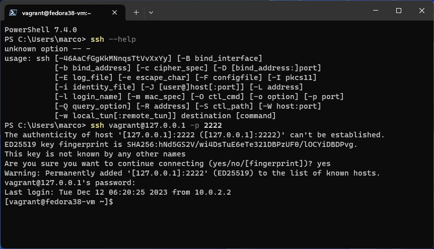
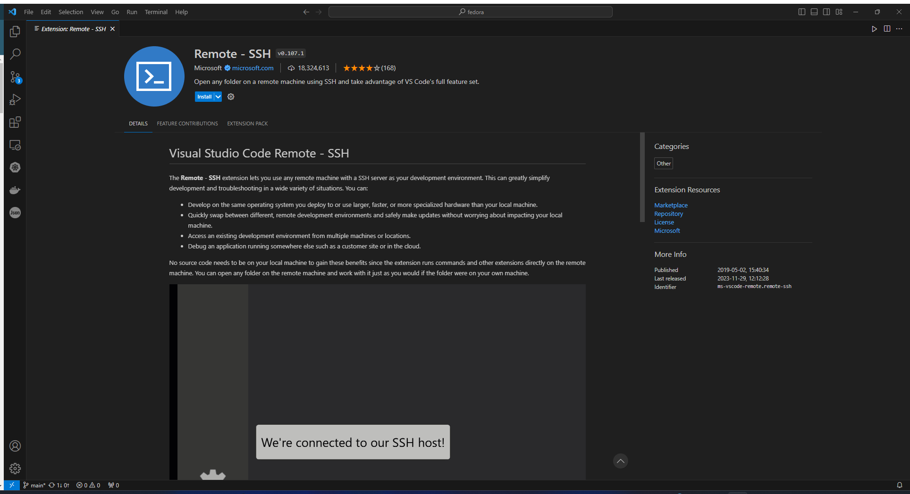
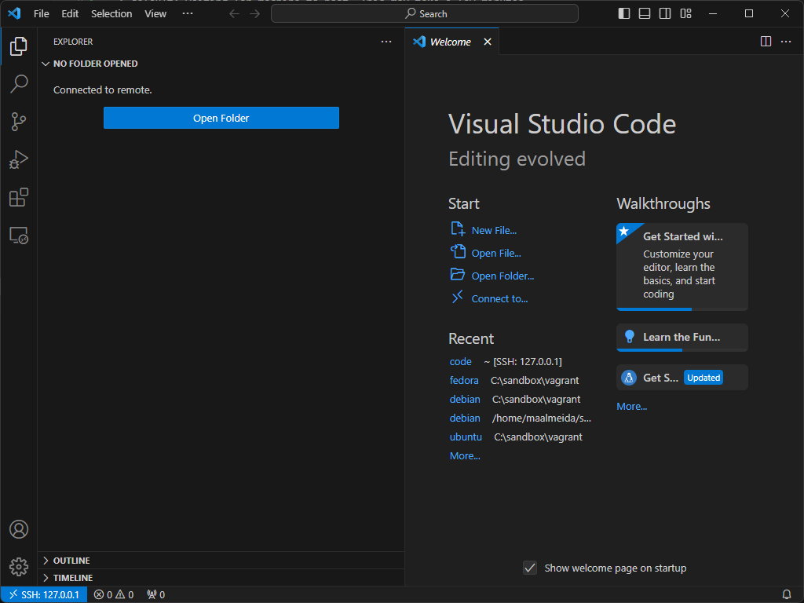
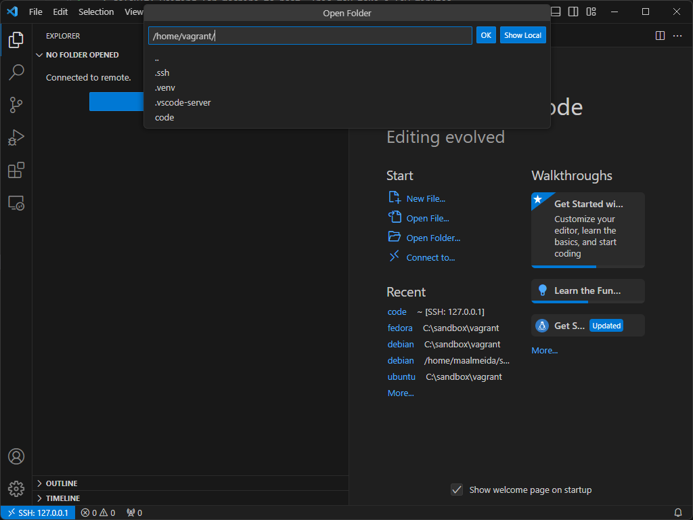
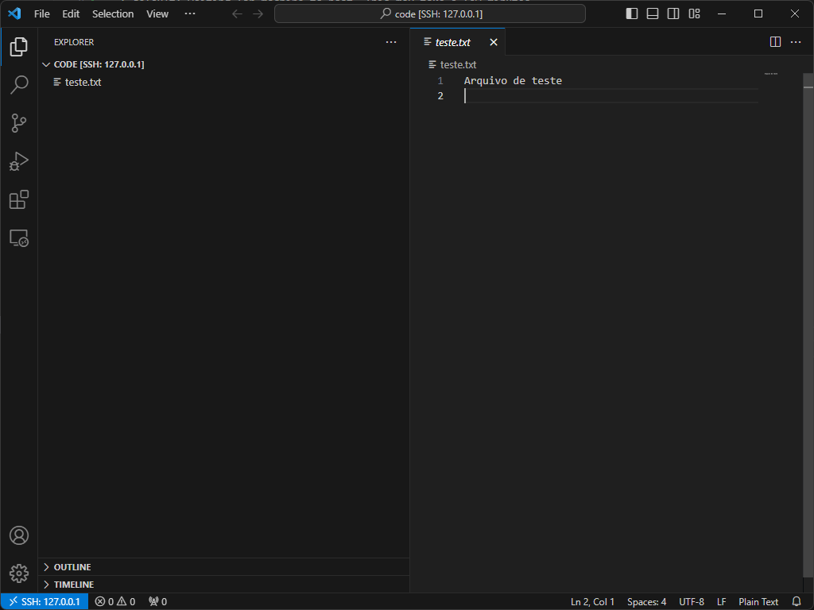

Pré-requisitos:

a) Virtualbox: [https://www.virtualbox.org/](https://www.virtualbox.org/)

b) Vagrant: [https://www.vagrantup.com/](https://www.vagrantup.com/)

Executem no diretório onde estiver o Vagrantfile:

```shell
vagrant up
```

Observem o log da VM que irá subir:  vagrant_up.log

Entre via ssh na VM e forneça a senha vagrant quando solicitado:

```shell
vagrant ssh
```

Vejam como se parece o primeiro acesso via ssh no Powershell: 

É importante fazer este acesso pelo Powershell para a VM se tornar um host conhecido para ssh.

Instalem a extensão de ssh para VS Code da Microsoft: 

Instalem esta extensão: 

Control-Shift-P -> Remote-SSH: Add New SSH Host

Enter SSH Connection command: ssh vagrant@127.0.0.1 -p 2222

A porta 2222 é ilustrativa. Veja no seu log de subida da sua VM qual porta realmente foi designada.

No log em anexo há o seguinte, indicando a porta designada:

==> default: Waiting for machine to boot. This may take a few minutes...
    default: SSH address: 127.0.0.1:2222
    default: SSH username: vagrant
    default: SSH auth method: password

A porta muda se houver mais de uma VM no ar.

Aceitem o diretório escolhido para vocês: C:\Users\username\.ssh\config

Para fazer a conexão: Control-Shift-P -> Remote-SSH ->  Remote-SSH:Connect to Host...

Selecione 127.0.0.1

Informe a senha vagrant mais de uma vez, a cada vez em que for solicitado.

Haverá instalações na VM requeridas pela extensão do VS Code.

Quando terminar, haverá uma nova janela do VS Code, mas voltada para dentro da VM:

 

 Próximo passo é escolher um diretório e começar a trabalhar.
 
 

 
 

Informe a senha quando solicitado.

Selecione code e abra o arquivo teste.txt:

 

Parece com o WSL.

Se funcionar bem, é assim que poderemos trabalhar em nossas VMs.
